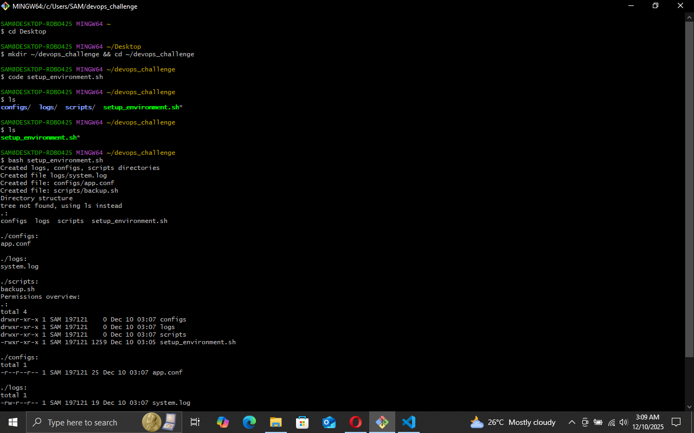

In this lab, I practiced using Git together with a Bash automation script to set up a simple DevOps project environment.
I created a repository, wrote a script that builds directory structures, handled file permissions, committed my work, and finally pushed everything to GitHub.
This helped me understand how scripting and version control work together in real DevOps workflows.

Task 1: Create the Project and Write the Script

I started by creating a project folder called devops_challenge and then wrote a Bash script named setup_environment.sh.

Inside the script, I added logic to:

Create the folders logs/, configs/, and scripts/

Create the files system.log, app.conf, and backup.sh

Add sample content using echo

Set permissions:

644 for system.log

444 for app.conf

755 for backup.sh

Detect if the directories already exist and print "Directory already exists"

Display the structure using tree (or install if tree isn’t installed)

Result: My script successfully automated the whole environment setup without requiring manual folder creation.

Task 2: Initialize Git Locally

Next, I turned my folder into a Git repository:

git init

Result: Git created a new repository and started tracking changes in my project.

Task 3: Stage and Commit My Work

I added all my files:

git add .

Then I committed them:

git commit -m "Add environment setup script and initial project structure"

Result: The script and all files were captured in my first commit.

Task 4: Connect to the Remote GitHub Repository

The GitHub repository already had a main branch, so I renamed my local branch to match:

git branch -M main

Then I added the remote:

git remote add origin https://github.com/Samuelatsyatsya/git-lab.git

I pulled the remote branch to sync:

git pull origin main --allow-unrelated-histories

Result: My local project was now connected and synchronized with the remote main branch.

Task 5: Push My Work to GitHub

Finally, I pushed everything online:

git push -u origin main

Result: My full project—including the setup script—appeared on GitHub.

Task 6: View Commit History

To verify my work, I viewed the commit history:

git log --oneline --graph

Result: Git displayed my commit clearly, showing that the repository was set up correctly.

3. Deliverables I Completed

Created and tested a full Bash automation script

Generated directories, files, and permissions through scripting

Used conditional logic to avoid recreating existing folders

Initialized a local Git repository

Made multiple commits

Connected and pushed everything to GitHub

Viewed commit history successfully

By completing this lab, I now understand how Bash scripting and Git work together in DevOps environments.
This strengthened my confidence in automation, file permissions, and version control used by real development teams.